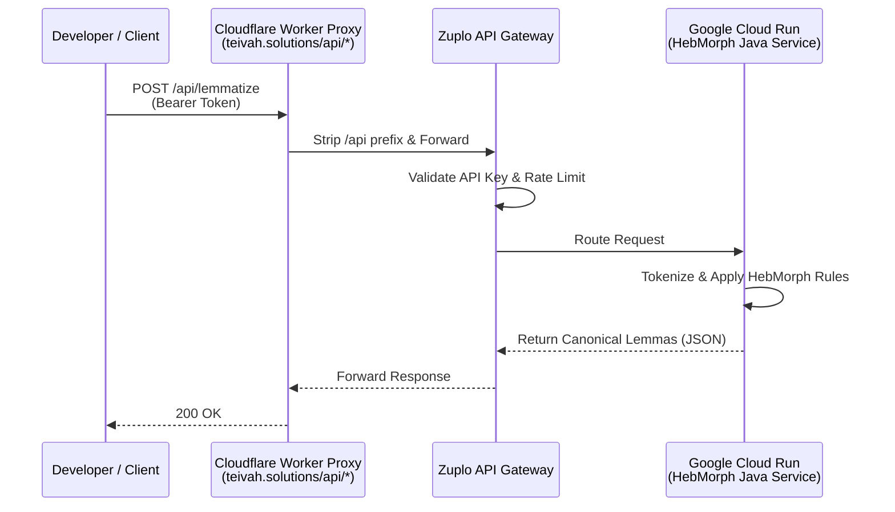
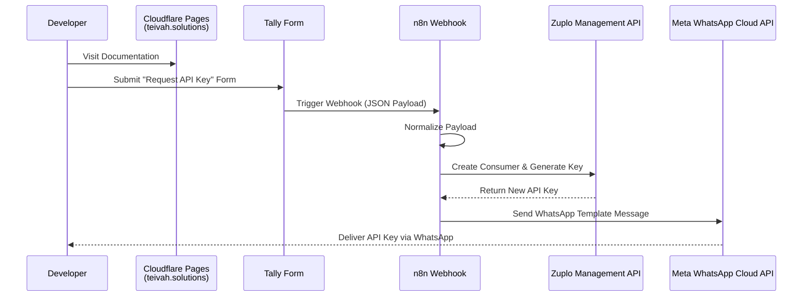

# HebMorph API — End-to-End Architecture

**🌐 Live Portal & Documentation:** [https://teivah.solutions](https://teivah.solutions)

## Overview

This project provides a fast, reliable REST API for Hebrew lemmatization. Developers can request an API key on the documentation site, receive it instantly via WhatsApp, and immediately start making requests to process Hebrew text.

Under the hood, the architecture is split into two main flows (or planes):

* **The Control Plane (Getting an API Key):** A developer visits the static documentation site (Astro/Cloudflare Pages) and fills out an embedded form (Tally). This triggers an automation workflow (n8n) that tells our API Gateway (Zuplo) to generate a new, unique API key for that user. Finally, the workflow uses the  WhatsApp Cloud API to send the key directly to the developer's phone.
* **The Data Plane (Using the API):** When a developer sends a request with their new key to `teivah.solutions/api/*`, a lightweight proxy (Cloudflare Worker) forwards it to the API Gateway (Zuplo) to keep the public URL clean. Zuplo validates the user's API key and routes the traffic to our core Java application (running on Google Cloud Run). The Java app executes the deterministic HebMorph linguistic logic and returns the processed text.

---

## High-Level Architecture

### 1. API Request Flow (Data Path)

### 2. API Key Issuance Flow (Control Path)

---

## Core Components

### 1. Lemmatization Service
* **Language:** Java
* **Framework:** Javalin
* **Core Engine:** HebMorph (revived)
* **Packaging:** Fat JAR (Gradle Shadow)
* **Containerization:** Docker

**Responsibilities:**
* Accept text input
* Tokenize + normalize
* Apply HebMorph
* Apply canonical selection logic
* Return structured JSON

**Endpoints:**
* `POST /lemmatize`
* `POST /lemmatize-raw`

### 2. Deployment Layer
**Platform:** Google Cloud Run
* **Region:** europe-west1
* **CPU:** 0.5
* **Memory:** 512MB
* **Concurrency:** 1
* **Scaling:** Minimum instances set to 1 to ensure a reliable service without cold starts.

**Why:**
* Simple deployment
* Managed infra

### 3. API Gateway Layer
**Tool:** Zuplo

**Responsibilities:**
* API key management (CRUD & validation)
* Rate limiting
* Request routing
* Public endpoint exposure

**Flow:**
`Client → Zuplo → Cloud Run`

### 4. Documentation Site
**Stack:**
* Astro
* Starlight
* Cloudflare Pages

**Responsibilities:**
* Public landing page (`https://teivah.solutions`)
* API documentation
* Working curl examples
* Terms page
* API key request CTA
* SEO/indexable content

### 5. Cloudflare Worker API Proxy
**Tool:** Cloudflare Workers
**Route:** `teivah.solutions/api/*`

**Responsibilities:**
* Keep public API under the main domain
* Hide the raw Zuplo gateway URL from users
* Forward requests to Zuplo
* Preserve method, headers, body, and query string
* Strip `/api` prefix before forwarding

**Why This Matters:**
Without the Worker, users would call the raw Zuplo URL directly. The Worker gives the product a clean, stable API surface. The backend gateway can be replaced later without changing public API URLs.

### 6. API Key Issuance Flow
**Frontend:** Tally form embedded in docs site.

**Automation Layer (n8n):**
* Self-hosted via Coolify on a Hetzner Cloud droplet.
* Receive Tally webhook submissions
* Normalize form payload
* Create Zuplo consumer + API key
* Send approved WhatsApp template message with the API key using the Meta Cloud API
* Keep onboarding fully automated

**Flow:**
`Tally form submission → n8n Webhook → Zuplo create consumer/key → Meta WhatsApp Cloud API → API key delivered to user`

---

## Canonical Processing Logic

**Pipeline:**
1. Tokenize
2. Strip punctuation
3. Run HebMorph
4. Sort candidates by score
5. Apply POS heuristics
6. Prefer exact match
7. Prefer shortest lemma
8. Filter invalid tokens

---

## Tech Stack & Design Decisions

| Component | Technology | Why |
| :--- | :--- | :--- |
| **Core Engine** | Java + HebMorph | Provides deterministic, production-stable lemmatization optimized for consistency and speed, making it suitable for search, indexing, and catalog normalization use cases. |
| **Hosting** | Google Cloud Run | Minimal infra management. |
| **API Gateway** | Zuplo | Clean API key management layer; avoids building custom auth/CRUD. |
| **Automation** | n8n (Self-hosted) | Orchestrates the onboarding flow (Tally → Zuplo → WhatsApp) without writing custom glue code. |
| **Container Orchestration** | Coolify | An open-source, self-hosted PaaS that automates Docker deployments, reverse proxies (Traefik), and SSL certificates. |
| **Infrastructure / VPS** | Hetzner Cloud | Cost-effective, high-performance VPS infrastructure for running internal services. |
| **Forms / Lead Capture** | Tally | Embeds cleanly as a modal, completely avoiding custom React/frontend form state management. |
| **Frontend** | Astro + Starlight | Fast static docs, minimal overhead, excellent developer UX, easy Markdown updates. |
| **Static Hosting** | Cloudflare Pages | Simple static hosting, fast edge delivery, easy custom domains. |
| **Reverse Proxy** | Cloudflare Worker | Clean public API path (`/api/*`), hides the raw gateway URL, decouples frontend domain from backend gateway. |
